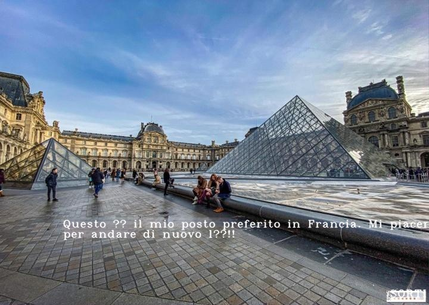
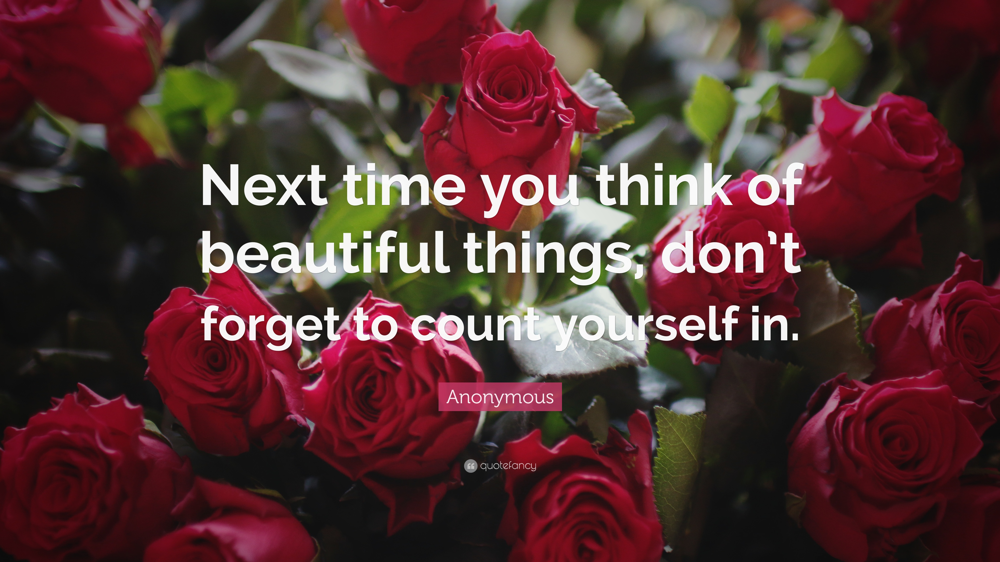

# picTranslate
Sometimes we need to translate the text written on the images while keeping the background same. This is generally the case when we are dealing with a foreign language based powerpoint presentation or any image with foreign context.
picTranslate is an AI based web app to translate the text on your image from one language to other while keeping the background of the image same as original. 
Most of the available apps show the translated text of the image in a separate window which degrades the experience and understanding of the user. In this app, the translated text is shown right on the original picture thus maintaining the originality of the scene. 

<table>
  <tr>
    <td>Input Image in English</td>
     <td>Output Image in Italian</td>
  </tr>
  <tr>
    <td></td>
    <td></td>
  </tr>
 </table>

# Technical stuff of the project
In this project, I've leveraged advanced Computer Vision based **EdgeConnect Inpainting** method to regenrate the background of the image in order to maintain the overall meaning of the subject. **AWS Textract** is used for OCR and **AWS Translate** is used for Language Translation. **Streamlit** is used to deploy the project in form of webapp, working with which was really exciting.

# Dependencies
`requirements.txt` should be referred to but some packages that you might miss are:-
* Torch
* Tensorflow 1.12
* Streamlit 0.62

`corerequirements.txt` contains all the packages that were installed on my environment during development of the project.

# How to use the repo
After cloning the repo, download weight files from [here](https://drive.google.com/drive/folders/1cGwDaZqDcqYU7kDuEbMXa9TP3uDJRBR1) and place them in the `./psv` directory. These are the weights 
of pretrained model of EdgeConnect and are required while program performs inpainting. 

**You would need AWS credentials to run the program.** 

Now there are two ways to run the program.

**Through picTranslate streamlit web app:-**

Once ready with credentials, type command **streamlit run app.py** 
picTranslate will open in your browser!!

**Through terminal via main.py:-**

Type command **python main.py --path (Image path) --sl (source language like en/es/it/fr) --tl (target language) --region_name (AWS region name)** for running in terminal only.

For eg.: **python main.py --path ./images/ABC.jpg --sl en --tl it --region_name us-east-2** Here source language is English and Target Language is Italian 

Font characteristics of the written text on the new image can be changed in the **Writer.py** file.

NOTE: The Ouput images will get stored in Output Folder and not results folder.

# Results

# Credits

Inpainting paper:  https://arxiv.org/pdf/1901.00212.pdf

Official Inpainting code: https://github.com/knazeri/edge-connect

AWS Textract, AWS Translate
